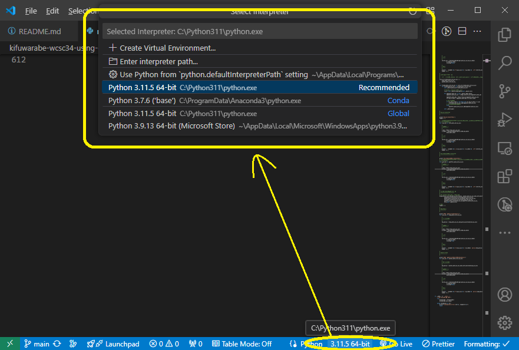

# Kifuwarabe_WCSC34_using_cshogi_remake

WCSC34 のきふわらべの作り直し


## Visual Studio Code で Python スクリプトを動かす方法

Python を公式からインストールすると環境設定が難しすぎる（不完全な初期状態で設定される）ので、  
Anaconda をインストールして、  
VS Code から適当に `*.py` ファイルを選択し、VSCodeのウィンドウの右下あたりから Python インタープリターを選択できるので、  
Anaconda の中に入っている Python インタープリターを選択した方が、断然早い  

📖 [https://www.anaconda.com/](https://www.anaconda.com/)  

例えば以下のフォルダーにインストールされる  

📁 `C:\Users\ユーザー名\anaconda3`  

```shell
# pip のバージョン確認。 19.0 以上が必要
pip -V

# cshogi をインストール
pip install cshogi

# 実行
python main.py
```

そして、適当に 📄 `*.py` ファイルを開く。  

  

👆 VS Code が使う Pythonインタープリターを Anaconda のものにしてください。それで動かなかったら、動くものにしてください  


## 将棋所にエンジン登録する方法

例えば、 📄 `main.bat` に以下のように書く。これをエンジン登録する

```shell
set PATH=%%PATH%%;C:\Users\muzud\anaconda3

python main.py
```


# 動作テスト

```shell
# 将棋エンジンを起動直後
selfmatch
```


# 仕様（Specification）

v_a53_0 版から、 `src_sq` は `srcsq` に改名し、値は 0～80 の整数または None とする。  
0～80 は、縦型の盤上のマスを指す。  

`src_drop` は `srcdrop` に改名し、0～80 を欠番とし、  
81 は飛打、 82 は角打、 83 は金打、 84 は銀打、 85 は桂打、 86 は香打、 87は歩打とする。  

また、上記２つを兼ねた `srcloc` を追加する。値は 0～87 とする。  
